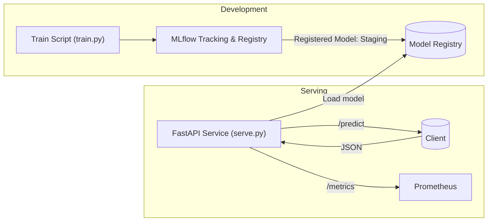

# MLOps Template: Train, Register, Deploy & Serve (FastAPI + MLflow)

This repository provides an end‑to‑end **model lifecycle** starter: **train → evaluate → register → deploy → real‑time inference → basic monitoring**.

- **Training/Registry**: MLflow (local server)
- **Modeling**: scikit‑learn (Iris dataset)
- **Serving**: FastAPI + Uvicorn
- **Metrics**: Prometheus client (exposed at `/metrics`)
- **Container**: Docker + docker‑compose

---

## Architecture Diagram



---

## Quickstart (Local)

```bash
# 1) Create venv & install
python -m venv .venv
# Windows: ./.venv/Scripts/activate
# macOS/Linux: source .venv/bin/activate
pip install -r requirements.txt

# 2) Start MLflow server (terminal A)
mlflow server   --host 127.0.0.1   --port 5000   --backend-store-uri sqlite:///mlflow.db   --default-artifact-root ./mlruns

# 3) Train & register the model (terminal B)
export MLFLOW_TRACKING_URI=http://127.0.0.1:5000
python src/train.py

# 4) Serve the API (terminal C)
export USE_MLFLOW=true
export MLFLOW_TRACKING_URI=http://127.0.0.1:5000
export MODEL_NAME=iris-classifier
export MODEL_STAGE=Staging
uvicorn src.serve:app --host 0.0.0.0 --port 8000

# 5) Invoke
curl -X POST http://localhost:8000/predict   -H "Content-Type: application/json"   -d @sample/payload.json
```

**Endpoints**
- `GET /healthz` – service health
- `POST /predict` – real‑time inference
- `GET /metrics` – Prometheus metrics

---

## Docker & Compose

```bash
# Build and start MLflow + API
docker compose build
docker compose up -d

# Train from host (logs to MLflow container)
export MLFLOW_TRACKING_URI=http://127.0.0.1:5000
python src/train.py

# Call API
curl -X POST http://localhost:8000/predict   -H "Content-Type: application/json"   -d @sample/payload.json
```

---

## Project Structure

```
mlops-template/
├─ requirements.txt
├─ docker-compose.yml
├─ Dockerfile
├─ README.md
├─ .gitignore
├─ models/
│  └─ latest/        # local fallback model artifact (created by train.py)
├─ src/
│  ├─ train.py
│  ├─ serve.py
│  ├─ schemas.py
│  └─ utils.py
├─ scripts/
│  └─ batch_infer.py
└─ sample/
   └─ payload.json
```

---

## GitHub: Push this repo

```bash
# Init repo and push to GitHub (replace <your-username> and <repo>)
git init
git add .
git commit -m "feat: mlops template with api + mlflow"
git branch -M main
git remote add origin https://github.com/<your-username>/<repo>.git
git push -u origin main
```

> Tip: Create the GitHub repo first (public or private), then run the commands above in the project folder.

---

## Environment Variables
- `USE_MLFLOW` (true|false) – choose registry vs local model
- `MLFLOW_TRACKING_URI` – MLflow server URI
- `MODEL_NAME` – registered model name (default: `iris-classifier`)
- `MODEL_STAGE` – stage to load (default: `Staging`)
- `LOCAL_MODEL_PATH` – path to local fallback model (default: `models/latest/model.pkl`)

---

## License
MIT (replace as needed)
